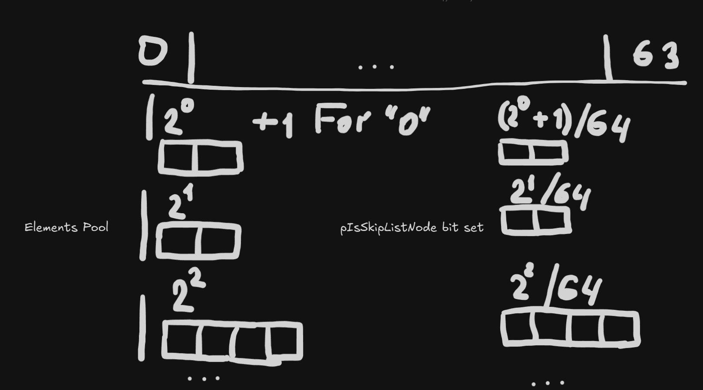
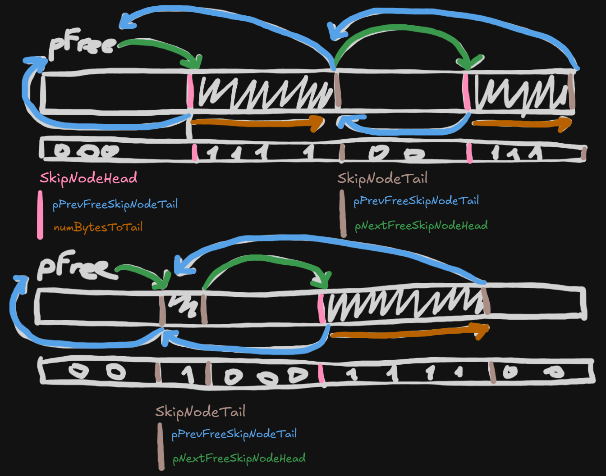

## KoPoolIteratable
___
A fast data structure that reduces allocations/deallocations, provides stable pointers, and enables fast iterations. Implementation of a pool allocator, designed to allow fast iteration and maintain more sequential allocation to reduce cache misses and improve memory layouts, while keeping pointers stable. To allow fast iterations, it jumps throught empty ranges and maintain this skip node list in the memory pool itself. The sizeof of the element must be >= 16 bytes because I store `SkipNodeHead` or `SkipNodeTail` per skip list node. Also, I maintain a bit set for each block of elements. For more see **Implementation** section.
___
## Benchmark

As `UnorderedSet` I use [unordered_dense](https://github.com/martinus/unordered_dense)

#### Allocation
	[KoPool] Allocate:      0.000031ms
	[STDVector] Push:       0.000013ms
	[UnorderedSet] Insert:  0.000111ms

	We see that allocation close to `std::vector` push

#### Deallocations
	[KoPool] Deallocate:    0.000138ms
	[STDVector] Pop:        0.000013ms
	[UnorderedSet] Erase:   0.000181ms

	We see deallocation close to `unordered_dense` erase. The deallocation version binary searches
	pointer in the exponential allocated blocks range - if we use for deallocation index, not pointer, it
	will be closer to `std::vector` pop_back

#### Iterations
	[KoPool] Iterate:       4.012267ms
	[STDVector] Iterate:    6.973767ms
	[UnorderedSet] Iterate: 3.654533ms

	With enabled vectorization:
	[KoPool] Iterate:       3.750200ms
	[UnorderedSet] Iterate: 3.688067ms

	We see iterations close to `unordered_dense`. In this test in `std::vector`, we store pointers
	to allocated data in `KoPoolIteratable` and before iterations, we shuffle `std::vector` to simulate
	situation when we allocate some data, then them push to `std::vector`, and remove this element using
	swap - pop back technique, which shuffles pointers inside `std::vector`, also the pointer address can't
	be sequential on the default allocation. In this example, `UnorderedSet`, so fast because we add a pointer
	sequentially in `UnorderedSet` and don't shuffle, the `UnorderedSet` stores data in `std::vector`,
	so it models the ideal case when memory is sequential, the best case for cache, and no jumps

#### Implementation

I use a strategy of exponential blocks - for x64 system I store a sequence of block where block entry index is a power of two (sum($2^0$ + ... + $2^{63}$ ) == $2^{64}$ - 1). Inside the first block, we store 2 elements $2^0$ + 1. To search a vacant block, I use msb/lsb intrinsic. Also, for each memory block, I store a bit set which indicates is an element or a skip node list.

**Exponential Structure**

I embedded a free list approach to search free ranges, and inside each skip list, I store `SkipNodeHead` and `SkipNodeTail`. The free list pointer, which points on skip nodes, is unordered, but skip nodes is the range between `SkipNodeHead` and `SkipNodeTail` ordered, and as a result, allocation is partialy sequential. To indicate a one-size range or is skip node, I use a bit set.

**Skip List Structure**

Also, when I deallocate an element, I track the last empty block, and if I have 2 empty blocks, deallocate the largest block to reduce memory consumption. Also, the element size must be >= 16 bytes because `SkipNodeHead` and `SkipNodeTail` of the skip node are 16 bytes. The pool doesn't uses templates, because I want to use it dynamicaly without any type, probably templates by type can improve performance in some cases.

